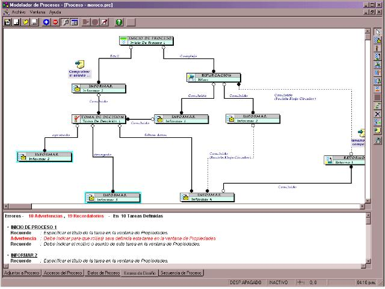



## Work Flow Designer

### Description

Este Modulo tiene la finalidad de otorgarles una herramienta para definir y diseñar los flujos de proceso de forma grafica dentro de una empresa, dichos procesos pueden ser exportados a una base de datos para ser automatizados. El modulo aqui presentado esta en su fase experimental y requiere aun de muchos ajustes y depuracion de codigo, lo pongo a su disposicion a fin de que ustedes puedan mejorarlo y ponerlo a disposicion de todos.
 
### More Info
 
Algunos componentes OCX y DLL's han sido obtenidos de http://vbaccelerator.com/ por lo que tendran que ser registrados previamente, si ustedes desean obtener las fuentes de dichos componentes recurran directamente a la pagina http://vbaccelerator.com/ para su descarga

hasta el momento consume mucha menoria

             |
---                |---
**Submitted On**   |2002-03-20 15:39:52
**By**             |[Rafael Planas Rivarola](https://github.com/Planet-Source-Code/PSCIndex/blob/master/ByAuthor/rafael-planas-rivarola.md)
**Level**          |Intermediate
**User Rating**    |4.7 (42 globes from 9 users)
**Compatibility**  |VB 6\.0
**Category**       |[Complete Applications](https://github.com/Planet-Source-Code/PSCIndex/blob/master/ByCategory/complete-applications__1-27.md)
**World**          |[Visual Basic](https://github.com/Planet-Source-Code/PSCIndex/blob/master/ByWorld/visual-basic.md)
**Archive File**   |[Work\_Flow\_638753202002\.zip](https://github.com/Planet-Source-Code/rafael-planas-rivarola-work-flow-designer__1-32887/archive/master.zip)

